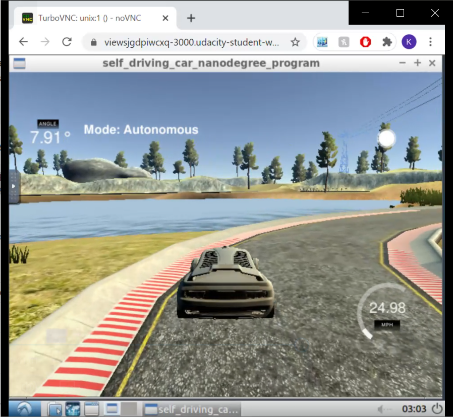
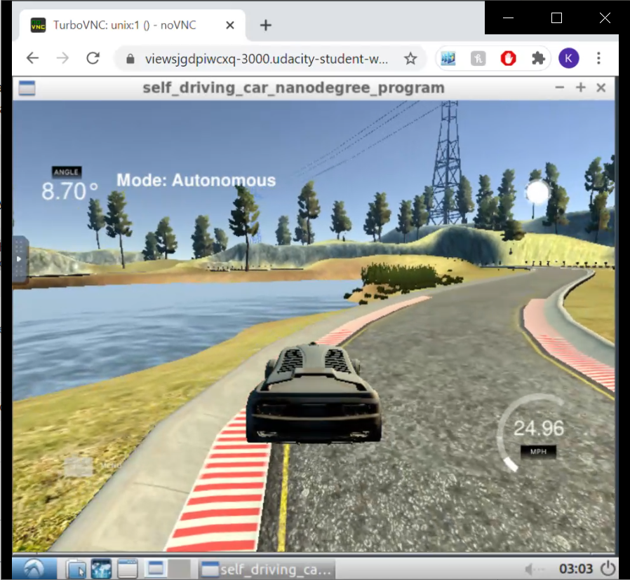
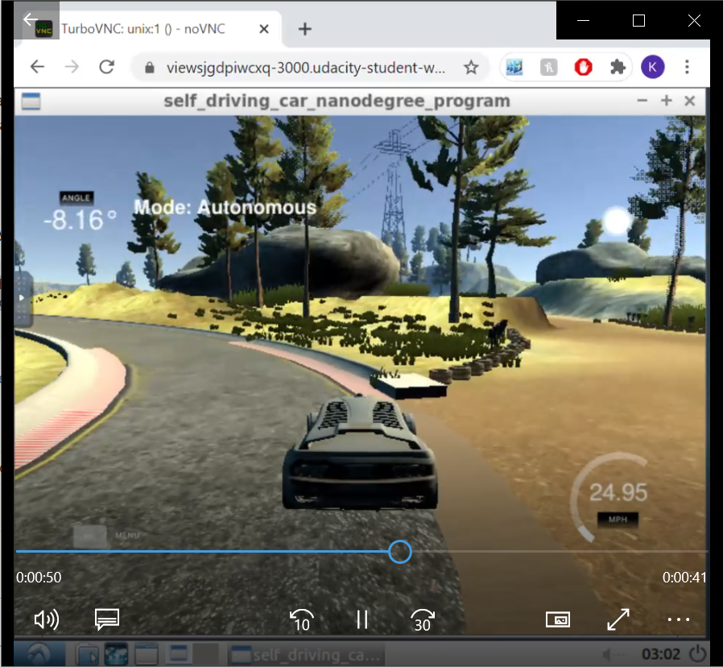

# PID Control Project

## Goal

The goal of this project is to write a PID controller for steering that will allow the vehicle in the simulator complete a lap around the test track. During the lap, the vehicle is required to not leave the track or drive on the ledges of the track. 

---

## Implementation

In this project, I populated the PID class, where a template was already provided by Udacity. I made one modification to `PID::UpdateError()` function by adding a limiter value for I error. This was because PID controllers don't have any reset function implemented and I error can build up to very large or very small values as it's summed over the whole operation. 

`PID::UpdateError()` in `PID.cpp` file is populated following the material shown in the course. The error value is directly assigned to the `p_error` in L26. `d_error` is set to the difference between current error and the error from previous cycle in L29. `i_error` is set to the accumulation of error with each cycle, and limited to `i_err_limit`, which is an input parameter for the function (L31-43).

In `main()` of `main.cpp` file, first two PID controllers created: steering, and speed. Each PID controller is initialized to previously determined coefficients in line 40 and 42. Then, with each message received from the simulator, both PIDs are updated and the output interfaces, steering and throttle, are set accordingly. 

The steering value is updated by calling `PID::UpdateError()` and `PID::TotalError()` functions consecutively, and by limiting the final output to between -1 and 1 (L62-77).

The throttle value is calculated by first calculating the error. The error is the delta between actual velocity of the vehicle and target speed value. Similar to steering value calculation, `pid_speed` is used for updating the errors and calculating the total error and total error is assigned to the throttle value. 

**Note**: Please modify the `speed_target` parameter in L81 for adjusting the speed. The code is tested in the track with speeds up to 40 mph. I have used the workspace provided by the Udacity and used the Simulator with Fastest graphics quality. 

---

## Reflection

### Effects of P, I, D

All of P, I, and D components of both PID controllers worked as expected. 

As explained in the course material, P component is good at making vehicle react to the increasing error; however, it doesn't count for the rate of change in the error as well. A higher P coefficient causes the vehicle to oscillate around the center. Even higher values eventually caused vehicle to go out of the track as the vehicle couldn't recover from the high steering angle that was given.

D component allowed the vehicle to react to increases or decreases in error earlier. Also, it helps with preventing "over-correction". As vehicle drifts from the center, the change in error is usually constant (except when vehicle is in a curve). Therefore, the D component is usually constant as well. Used together with P component, it balances and helps vehicle to have a smoother drive and better reaction in curves.

The PID controller still needed an I component because the CTE had a constant offset about `0.5`. The increase in P and D coefficients didn't really help with reducing this constant offset. The I component helped with removal of this bias and reduced the CTE value throughout the drive. This also proved beneficial with speed controller, as the vehicle mostly struggled to reach the target speed with only P and D components. 

### Tuning
For this project, I have decided to manually tune the PID parameters instead of implementing a twiddle algorithm. To begin with, I have started by only tuning P coefficient. I have increased the P controller until an oscillation occurred, then decreased it to a point where the vehicle was able to drive around the first curve. However, the vehicle was reacting too late at the curves because the coefficient was decreased to avoid oscillations. 

Then, I started tuning the D coefficient. Increasing the D controller helped with the vehicle to drive around all curves around the track. By just having non-zero values in P and D coefficients, the vehicle was able to complete a lap around the track. The values used for steering PID were: `0.07, 0.0, 0.4`, for P, I and D coefficients respectively. 

After, I added the I component, by incrementing `0.0001` at each step. Setting it to `0.0004` removed the bias that the vehicle has. 

Finally, the vehicle was still *reacting late* in the curves and barely avoiding going outside of the track. In order to help vehicle around curves, I incremented P and D components and conducted test drives around the track until I was happy with the performance. The final coefficients for steering PID are: `0.083, 0.0004, 0.82` for P, I, and D respectively. 

## Examples
**1. Vehicle drives on the outside of the lane:** In this example, the vehicle takes the curve on the outside; however, recovers before reaching the ledge. 
 

**2. Late recovery:** Similar to the example above, here the vehicle also has a late recovery but keeps the vehicle in lane. 
